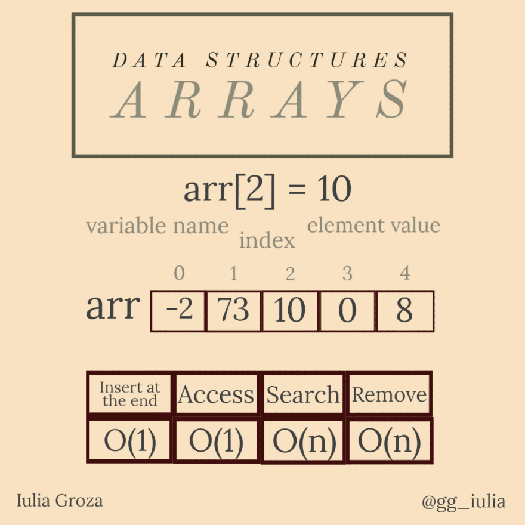
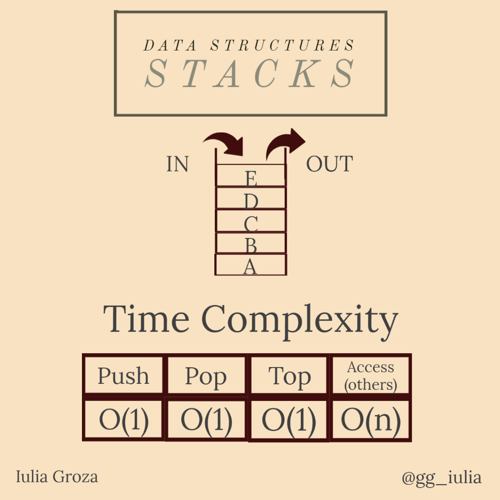
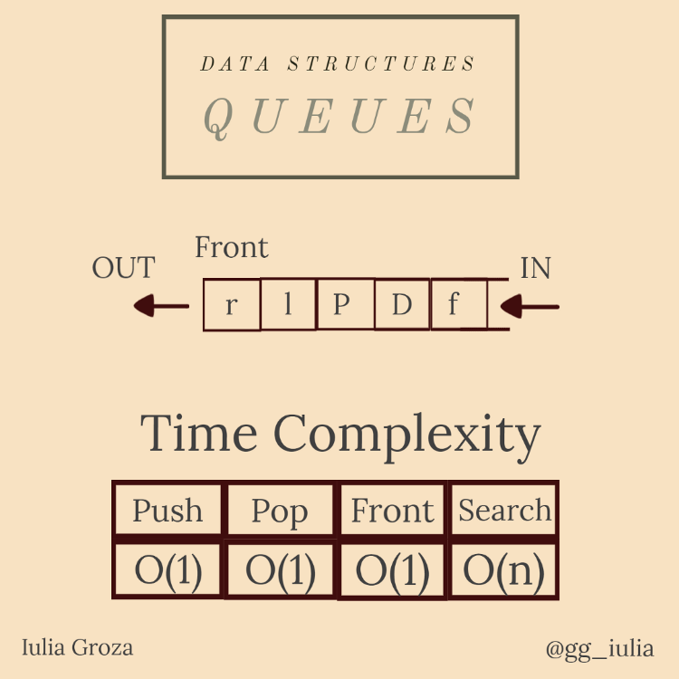
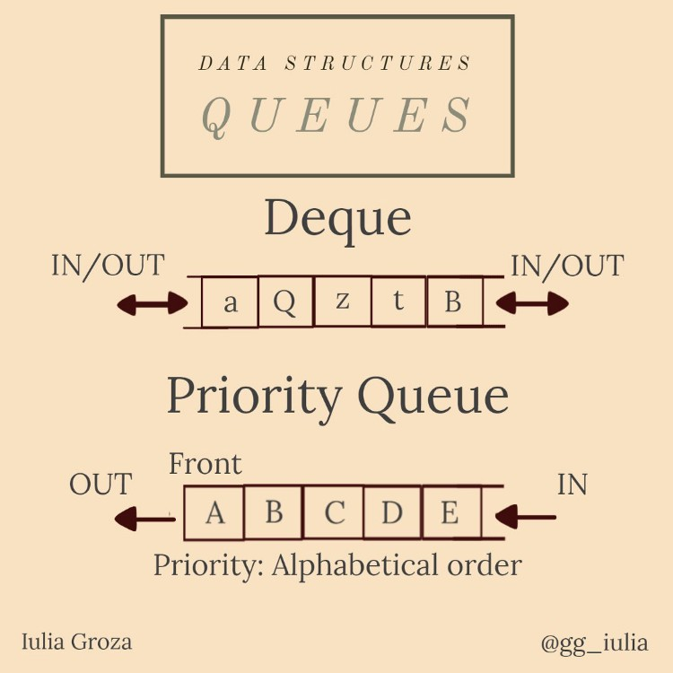
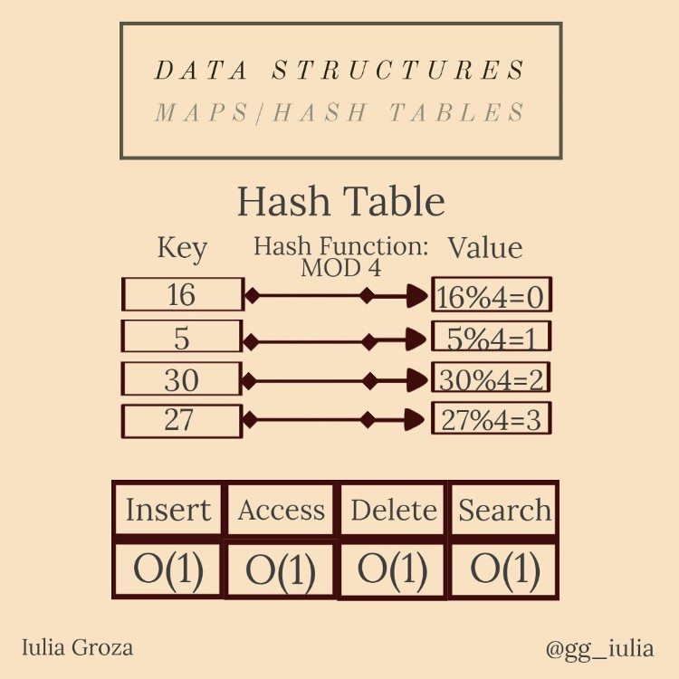
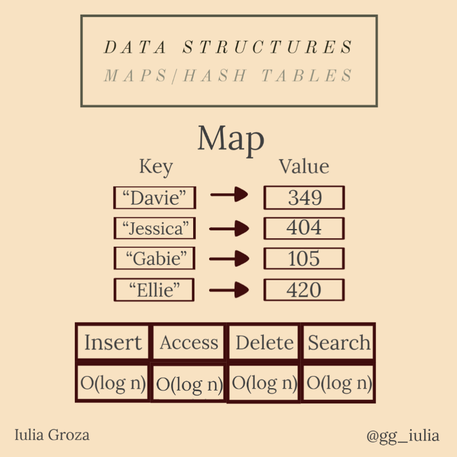

## Week 7 & 8 - Data Structures

### Arrays
Zero Indexed (indexed from 0 to n-1).
Arrays have a fixed Capacity, meaning you must know the size of the data beforehand. The only way to increase the capacity of a array is by creating a new array.
Array's can be randomly accessed, as long as the index is within the bounds of the array.
Array's are Contiguous Memory (stored in a block in one place), but in C# they are also objects.

Types of Arrays:
- Single Dimensional: A single line of elements.
- Multidimensional: Creates a matrix of elements.
- Jagged: An array of arrays

Operations:
- Insert: Adds element to the end of the array. O(1) time complexity.
- Access: Returns the element of a given index. O(1) time complexity.
- Search: Iterates through the array until a given index is located. O(n) time complexity.
- Remove: Seaches for given index, removes it and then reconstructs the array 1 index shorter. O(n) time complexity.

Here is a nice infograpghic demonstrating a array: 

### Stacks
Stacks follow LIFO, meaning Last-In, First-Out.
They can be implemented with either a linked list or a dynamic array.
The Stack class in C# is implemented through a dynamic array.
Stacks do not allow random access, but you can peek at the top of the stack, but nothing further!
When resized the stacks size is automatically increased by twice the initial size.
Depending on how the stack is implemented determines how it is stored in memory.

Operations:
- Push: Adds a element to the top of the stack. Time Efficiency: O(1)O(1). 
- Pop: Removes and returns the top element of the stack: Time Efficiency: O(1)O(1). 
- Peek: Allows you to look at the top element of the stack. Time Efficiency: O(1)O(1).

Here is a nice infograpghic demonstrating a Stack:  

### Queues
Queues follow FIFO, meaning First - In, First - Out.
They are easiest to implement using a linked list, but can also be implemented using a array, in C# the queue class utilizes a circular array
Queues do not allow random access, but you can peek at the head of the queue, but nothing further!
When full the queue's size increases by a default growth factor of 2 in C#.
Depending on how the queue is implemented determines how it is stored in memory.

Special Types:
- Deque: Insertion and removal can be done on both ends of the queue. Does not follow FIFO.
- Circular Queue: The last element points back to the head of the queue.
- Priority Queue: Each element is given a priority and is served with this priority in mind.

Operation: 
- Enqueue: Add a element to the tail/end of the queue. Time Efficiency: O(1).
- Dequeue: Removes and returns the element at the head of the queue. Time Efficiency: O(1)
- Peek: Returns the head of the queue. Time Efficiency: O(1)

Here is a nice infograpghic demonstrating a Queue:   

### Hash Tables
A abstract data type that contains a collections of keys and a collections of values. 
A "Hash Function" is used to map a key to location (bucket) in the data structure.
"Hashing" is when you use a hash function to index a hash table.
A "Collision" is when a Hash Function returns a hash code to a bucket in the structure already holding a item, when this happens you need a collision policy.
Two popular collision stratogies are chaining and open addressing.
Hash Tables have a load factor which determines the maximum ratio of elements to buckets.
Allows for lookup by key.
Great for fast look ups and the flexibility of its keys.

Collision Resolution Strategies
- Separe Chaining (Closed Addressing): Uses a structure such as a linked list as the bucket to hold multiple entries in a singles index.
- Open Addressing: Uses only the hash table.
  - Linear Probing
  - Quadratic Probing
  - Double Hashing
- Coalesced Hashing
- Cuckoo Hashing
- Hopscotch Hashing
- 2-Choice Hashing
- Robin Hood Hashing: Moves elements slowly away from prefered as new elements come in that could make better use of that place in the table.

Operation Speeds: 
- Insert: O(1) 
- Access: O(1) 
- Delete: O(1) 
- Search: O(1)
  
Here is a nice infograpghic demonstrating a Hash Table:   

###Assigntment 3 - Data Structures
In my application you will see a stack and queue with the same items created and a array and hash table with the same large amount of data read into them. 
The stack and queue deomonstrate that their unique ues come from the direction you want the data back in, FIFO or LIFO. 
The array and hash table examples show how the hash table excels at lookups over the array.
